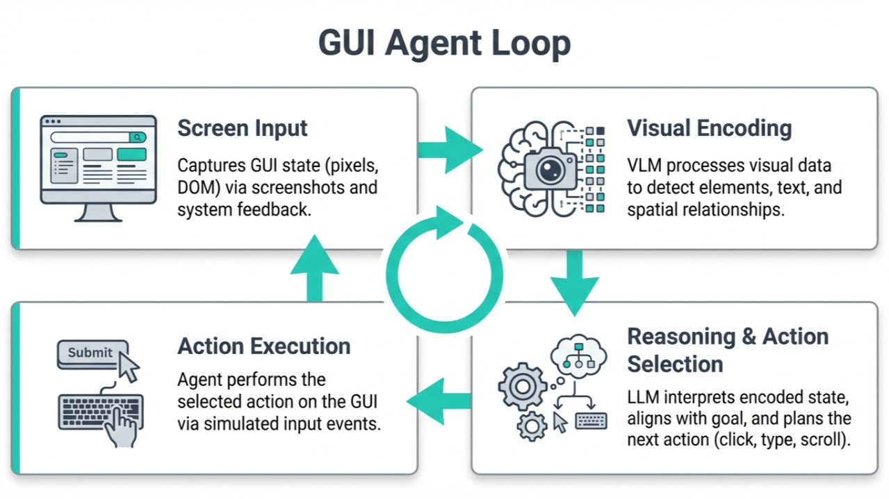

# Deployment Experience of MCon

MCon has been adopted by a major AI company, accelerating end-to-end RL training speed of mobile agents by 56%, and reducing mobile infrastructure cost by 60%. This document shares the production experience and lessons learned from deploying MCon in this setting.

## Why RL-trained GUI agents need elastic mobile infrastructure

Emerging workloads require elastic mobile clouds. One important example is training mobile GUI agents with reinforcement learning (RL). These agents operate directly on app interfaces: they observe the screen, choose actions such as tap, swipe, type, back, and home, and try to complete user-facing tasks such as navigation, search, or form filling.

Unlike language-only tasks, GUI tasks unfold over long, stateful interaction sequences. A single mistake can send the agent to the wrong screen, trigger a pop-up, or corrupt the current app state. As a result, GUI agents must learn not only how to follow successful action patterns, but also how to recover from mistakes, explore unfamiliar states, and adapt to diverse app behaviors.

RL is useful in this setting because it improves agents through repeated trial and error. In production, the basic training unit is a loop called **rollout**: start a fresh mobile instance, launch an app, let the agent interact for some number of steps, record rewards and outcomes, and then reset the environment for the next trial. Each rollout produces a trajectory of observations, actions, and rewards that is sent back to the learner.

This loop is simple in concept, but demanding in practice. Mobile apps expose large state spaces, and each rollout usually covers only a tiny fraction of them. Useful training therefore requires many rollouts across tasks, apps, seeds, and partial states. To keep the learner busy and maintain enough diversity in the collected data, the system must supply hundreds of concurrent fresh instances rather than a small number of long-lived devices.

This makes GUI-agent training a systems problem as much as a learning problem. The throughput of the overall RL pipeline depends directly on how quickly the platform can allocate a clean mobile environment, start the target app, and recycle the environment after the rollout ends. If instance startup or reset is slow, the learner waits for experience, rollout workers idle, and hardware is underutilized.

For this reason, the production challenge is to sustain a large, bursty stream of short-lived, isolated, and quickly resettable mobile environments. MCon is valuable in this setting because faster provisioning and higher instance density translate directly into faster rollout turnover, better hardware efficiency, and ultimately faster end-to-end RL training.

## How MCon is used in Production

MCon was deployed in production as the mobile environment backend for a major AI company's internal GUI-agent training system. Here are some details of the production system and the deployment experience.

### Mixed GPU infrastructure

In production, rollout and model training run on different classes of GPUs. Android environments run on machines with separate render cards such as NVIDIA RTX 4090 GPUs, because these cards provide the rendering quality and stability needed by vision-based GUI agents. Model training runs on NVIDIA A100 or H100 GPUs, where larger memory is needed for model weights, activations, and larger training batches.

In practice, one RL pipeline spans both pools. Render nodes host the Android environments and execute rollouts. Training nodes host the models, consume collected trajectories, update the policy, and send new checkpoints back to the rollout workers. This split matches the strengths of the hardware: render cards are used for environment execution, while data-center GPUs are used for model learning.

### Integration with existing benchmarks and training stacks

MCon fits naturally under existing mobile-agent benchmarks such as AndroidWorld. These systems already expect an environment that can start a task, return screenshots and observations, accept actions, and reset between episodes. MCon can serve as that environment backend without changing the benchmark logic itself.

This is important in practice. We do not want to rewrite task definitions, evaluation code, or agent logic just to change the mobile backend. With MCon, the interface seen by the agent remains the same, while the environment implementation becomes much faster and denser underneath.

### Rollout scale in production

Our production jobs typically use rollout batch sizes of **128 to 512**. In other words, a single training run may keep **128--512 Android instances** active at the same time. The average task duration is about **60 seconds**, although the exact length depends on task complexity.

At this scale, environment management becomes a first-order concern. Because each rollout is relatively short, the system spends a surprisingly large fraction of wall-clock time (often more than **50% of total rollout time**!) preparing the next clean environment.

MCon improves this workflow in two ways. First, it drastically cuts the time needed to reset Android environments (by more than **3×**). Second, it allows much more (**2×**) Android instances to run under the same hardware budget. These two effects reinforce each other: faster reset increases rollout turnover, and higher density increases concurrency and therefore less time to collect the same number of trajectories.

The end result is a better-balanced RL system. In production, these gains improved end-to-end RL training speed of mobile agents by **56%** and reduced mobile infrastructure cost by **60%**.
