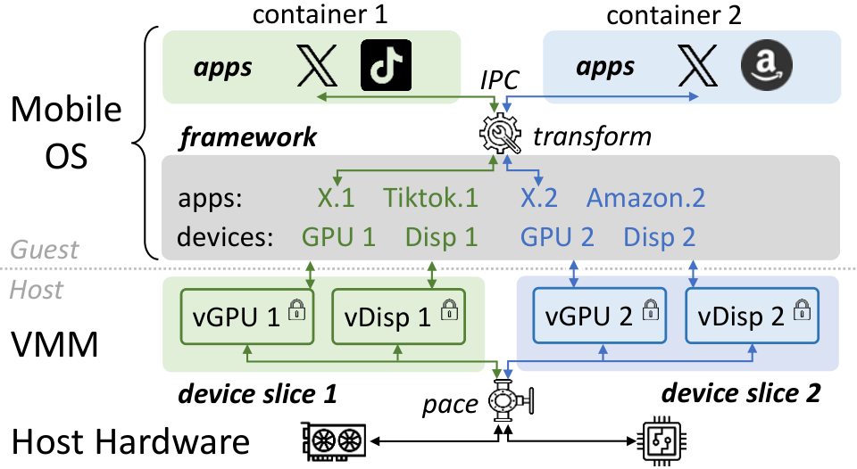

## Table of Contents

- [Introduction](#introduction)
- [Code and Data Release](#code-and-data-release)
  - [Figures and reproduction artifacts](#figures-and-reproduction-artifacts)
  - [Source code and data](#source-code-and-data)

## Introduction

Cloud execution of mobile apps---running unmodified apps inside full mobile OSes on commodity servers---is gaining adoption
for uses such as GUI agent training and large-scale app testing.
These workloads are both temporally dynamic (from second-scale agent interactions to hour-long tests) and
highly bursty (up to hundreds of concurrent jobs), demanding an elastic platform that can provision mobile environments quickly and at high concurrency.

Existing stacks fall short because each tenant must cold-initialize the mobile framework (a large collection of shared libraries and system services)
before any app can run, inflating boot latency.

We present MCon, the first container system with the *framework consolidation* architecture:
the framework is run as a shared, multi-tenant service instead of a per-tenant component.
The core challenge is to practically enable per-tenant isolation on a large framework with no native multi-tenant support.
MCon achieves this from *outside* the framework: by leveraging the fact that apps interact with the framework solely through IPC,
we virtualize the IPC interface to construct private views of framework and device resources.

Compared to the best existing stacks, MCon achieves sub-second (15× as fast) cold tenant allocation and improves instance density to 2.6×,
decisively improving elasticity for cloud-hosted mobile workloads.
MCon has been used to train mobile agents in a major AI company.

## Code and Data Release

All the released code and data can be found at our github repo, [github.com/mobile-container/mobile-container.github.io](https://github.com/mobile-container/mobile-container.github.io).

### Figures and scripts

All the evaluation figures used in the paper are included in [`figs/`](https://github.com/mobile-container/mobile-container.github.io/tree/main/figs/).
The scripts / jupyter notebooks we used to generate these figures are available in [`scripts/`](https://github.com/mobile-container/mobile-container.github.io/tree/main/scripts/).

The table of top-50 apps used in the application benchmark (Section 7.4) is available [here](https://github.com/mobile-container/mobile-container.github.io/tree/main/docs/fifty-apps.md/).

### Source code and other documentation

We have obtained permission to release our full implementation. We are still following relevant internal procedures of the AI company for open source,
so the Android source (which is large) may take some time to fully publish.

More relevant details (for example, technical details regarding our device cluster in production and guidelines to reproduce our results) are on their way.
